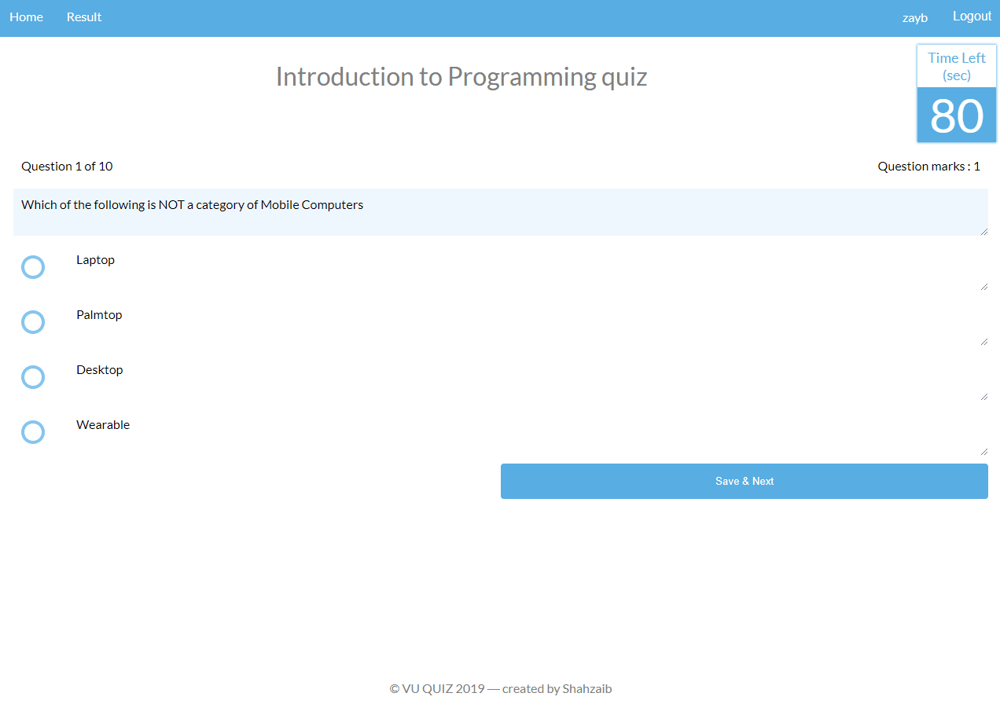

# VU Quiz

VU Quiz is a demo application, same as the [Virtual University of Pakistan](http://vu.edu.pk/)'s quiz system.
You can take quiz in any VU's [subjects](https://ocw.vu.edu.pk/) you like, for practice or for fun.



## Running vuquiz locally
vuquiz is a [Spring Boot](https://spring.io/guides/gs/spring-boot) application built using [Maven](https://spring.io/guides/gs/maven/). You can build a jar file and run it from the command line:


```
git clone https://github.com/shahzayb/vuquiz.git
cd vuquiz
./mvnw package
java -jar target/*.jar
```

You can then access vuquiz here: http://localhost:8080/

Or you can run it from Maven directly using the Spring Boot Maven plugin. If you do this it will pick up changes that you make in the project immediately (changes to Java source files require a compile as well - most people use an IDE for this):

```
./mvnw spring-boot:run
```

By default active profile will be "dev" and this profile will load initial data for application

## In case you find a bug/suggested improvement for Spring vuquiz
My issue tracker is available here: https://github.com/shahzayb/vuquiz/issues

## Working with vuquiz in your IDE

### Prerequisites
The following items should be installed in your system:
* Java 8 or newer.
* git command line tool (https://help.github.com/articles/set-up-git)
* Your preferred IDE 
  * Eclipse with the m2e plugin. Note: when m2e is available, there is an m2 icon in `Help -> About` dialog. If m2e is
  not there, just follow the install process here: https://www.eclipse.org/m2e/
  * [Spring Tools Suite](https://spring.io/tools) (STS)
  * IntelliJ IDEA
  * [VS Code](https://code.visualstudio.com)

### Steps:

1) On the command line
```
git clone https://github.com/shahzayb/vuquiz.git
```
2) Inside Eclipse or STS
```
File -> Import -> Maven -> Existing Maven project
```

Run the application main method by right clicking on app and choosing `Run As -> Java Application`.

3) Inside IntelliJ IDEA

In the main menu, choose `File -> Open` and select the vuquiz [pom.xml](pom.xml). Click on the `Open` button.

Then run configuration named `VuQuizDemoApplication` should have been created for you if you're using a recent Ultimate
version. Otherwise, run the application by right clicking on the `VuQuizDemoApplication` main class and choosing
`Run 'VuQuizDemoApplication'`.

Visit [http://localhost:8080](http://localhost:8080) in your browser.

## Contributing
Pull requests are welcome. For major changes, please open an issue first to discuss what you would like to change.

Please make sure to update tests as appropriate.

## License
[MIT](https://choosealicense.com/licenses/mit/)
